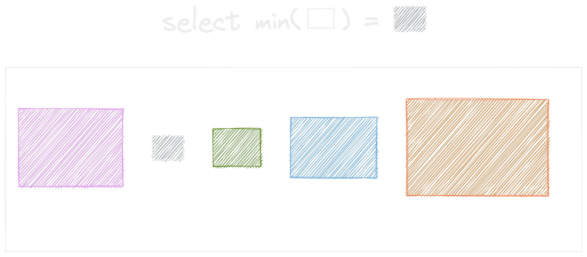
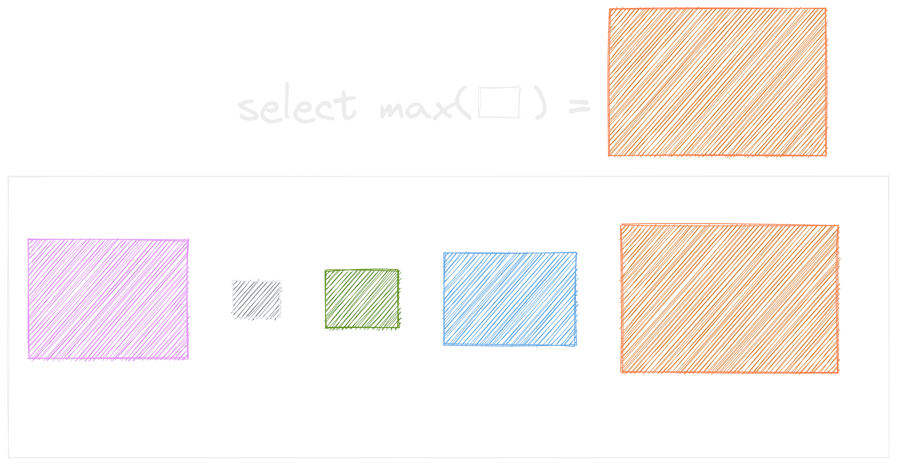
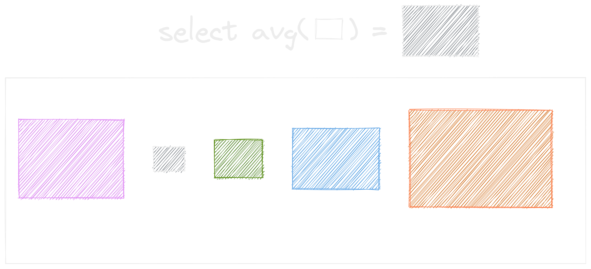
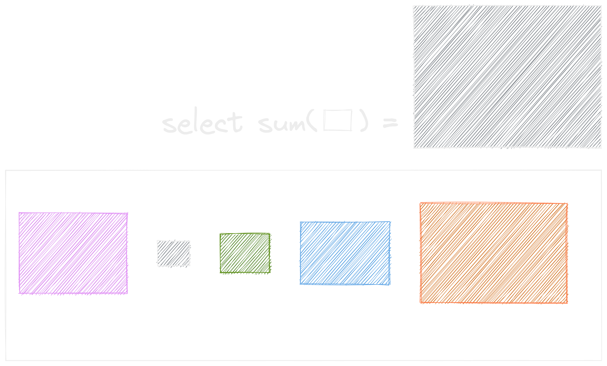
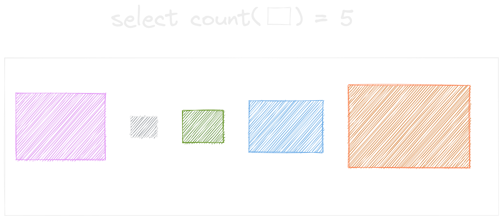
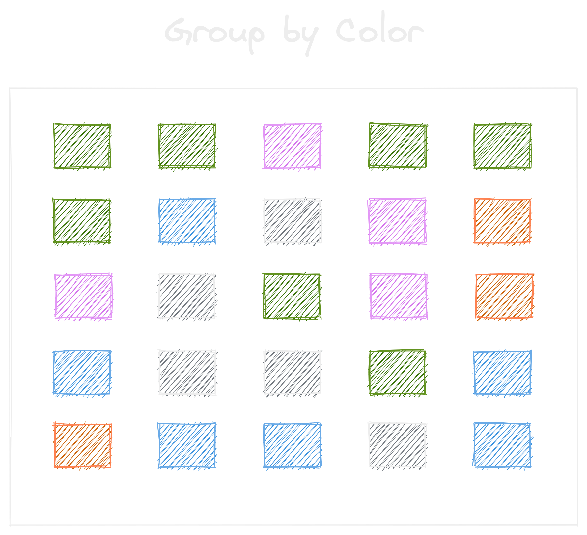
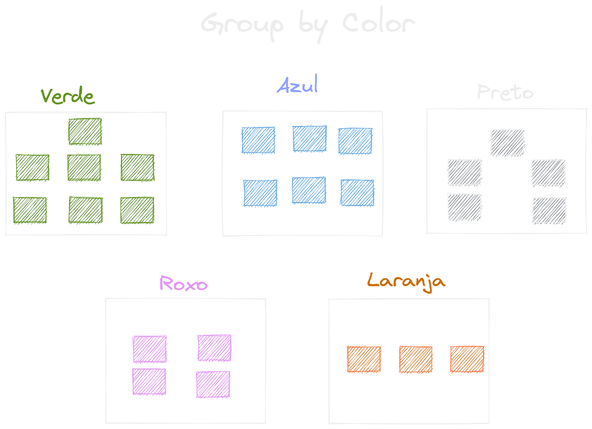
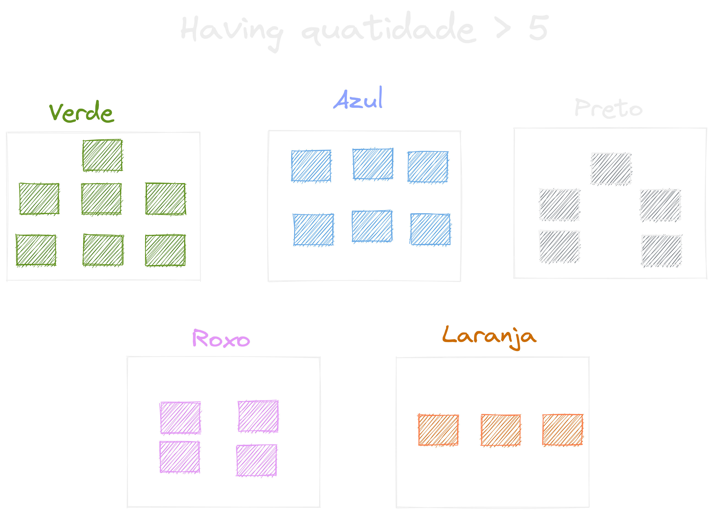
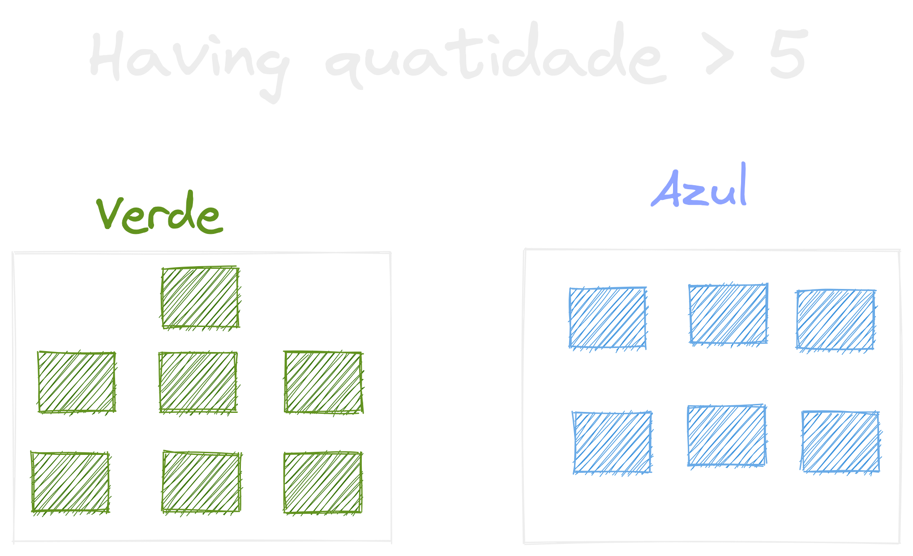

## Aula 21.1

{ width=60% }

---

## Foco de hoje

- If / Case
- Strings
- Operadores Matemáticos
- Operações com datas
- Funções de Agregação
- Agrupamentos
- Filtro de Agrupamento(Having)

---

### IF / CASE

> E se?

---

#### Descubra se uma pessoa é maior de idade

```sql
SET @age = 14;
SELECT IF(@age < 18, 'Di menor', 'Di maior');
```

---

#### Para mais de um cenário, usamos o `CASE`

```sql
SELECT title, release_year, length,
CASE
    WHEN length <= 60 THEN 'Short duration'
    WHEN length > 60 AND length <= 150 THEN 'Medium duration'
    ELSE 'Long duration'
END AS film_duration_type
FROM sakila.film;
```

---


### Strings

* LENGTH
* UCASE
* LCASE
* REPLACE
* LEFT
* RIGHT
* SUBSTRING.

---

### Operadores matemáticos

{ width=50% }

---

* DIV
* MOD
* ROUND
* CEIL
* FLOOR
* POW
* SQRT
* RAND

---

### Operadores aritméticos
> Calculando ...

```sql
SELECT 10 + 10;

SELECT 10 - 10;

SELECT 10 * 10;

SELECT 10 / 10;
```

---

### Outros operadores

```sql
SELECT 20 DIV 3; -- retona o número inteiro da divisão

SELECT 18 MOD 3; -- retorna o resto de uma divisão inteira

SELECT ROUND(20.49, 1); -- permite arredondar um valor

SELECT CEIL(20.51); -- arredonda para o número inteiro (cima)

SELECT FLOOR(10.51); -- arredonda para o número inteiro (baixo)

SELECT POW(2, 5); -- potenciação onde temos X elevado a Y.

SELECT SQRT(16); -- retorna a raiz quadrada
```

---

### Operações com datas

{ width=50% }

---

* CURRENT_DATE
* NOW
* DATEDIFF
* TIMEDIFF

---

#### Diferença entre datas

```sql
SELECT DATEDIFF('2020-05-01', '2020-05-31');
SELECT DATEDIFF(return_date, rental_date) FROM sakila.rental;
```

---

#### Diferença de tempo

```sql
SELECT TIMEDIFF('05:15:30', '06:15:30');
SELECT TIMEDIFF('05:15:30', '05:12:30');
SELECT TIMEDIFF(return_date, rental_date) FROM sakila.rental;
```

---

#### Extraindo uma parte expecífica da data
```sql

SELECT return_date, DATE(return_date) FROM sakila.rental;

SELECT return_date, MINUTE(return_date) FROM sakila.rental; 

```

---


### Funções de Agregação

> Geralmente utilizados em relatórios e gráficos

{ width=50% }

---

{ width=90% }

```sql
SELECT MIN(rental_duration) FROM sakila.film;
```

---

{ width=90% }

```sql
SELECT MAX(rental_duration) FROM sakila.film;
```

---

{ width=90% }

```sql
SELECT AVG(rental_duration) FROM sakila.film;
```

---

{ width=90% }

```sql
SELECT SUM(rental_duration) FROM sakila.film;
```

---

{ width=90% }

```sql
SELECT COUNT(rental_duration) FROM sakila.film;
```

---

### Group By

---

{ width=70% }

---

{ width=80% }

---

```sql
-- Agrupa por rating
SELECT rating FROM sakila.filme GROUP BY rating;

-- Dessa forma, o GROUP BY nos traz o primeiro registro de cada grupo.

-- Traz a média do custo de substituição de cada grupo
SELECT rating, AVG(replacement_cost) FROM sakila.film GROUP BY rating;
```

---


### Having

(Where dos grupos)

---

{ width=80% }

---

{ width=80% }

---

### Dúvidas?

{ width=90% }

---

### Exercícios

---

### Exercício 1

Média de dias que uma pessoa usuária permanece com o produto alugado

---

### Exercício 1 - solução

```sql
SELECT 
    customer_id, 
    AVG(datediff(return_date, rental_date)) as `diff`  
FROM sakila.rental
GROUP BY customer_id;
```

---

### Exercício 2

Tempo máximo, mínimo e a média de tempo dos filmes lançados em 2006 por rating

---

### Exercício 2 - solução

```sql
SELECT 
    rating, 
    AVG(length), MAX(length), MIN(length) 
FROM sakila.film
GROUP BY rating;
```

---

### Exercício 3

Quantas pessoas usuárias temos por cidade?

---

### Exercício 3 - solução

```sql
SELECT 
    city_id as 'Cidade', 
    COUNT(city_id) as `qtd`
FROM sakila.address
GROUP BY `city_id`
ORDER BY `qtd` DESC;
```

---

### Exercício 4

Qual o valor total recebido dentro de cada mês?

---

### Exercício 4 - solução

```sql
SELECT  
    SUM(amount) as `soma`, 
    year(payment_date), 
    month(payment_date) 
FROM sakila.payment
GROUP BY year(payment_date), month(payment_date)
ORDER BY year(payment_date), month(payment_date);
```

---

### Exercício 5

Quantidade de itens alugados pelo preço

---

### Exercício 5 - solução

```sql
SELECT 
    amount as `preço`, 
    COUNT(amount) as `qtd`
FROM sakila.payment
GROUP BY amount
HAVING amount <= 1.99
ORDER BY `qtd` DESC;


```

---

### Exercício 6

Qual valor total arrecadado agrupado por mês, ano e `amount`?

---

### Exercício 6 - solução

```sql
SELECT 
    amount, 
    SUM(amount) as `soma`, 
    year(payment_date), 
    month(payment_date) 
FROM sakila.payment
GROUP BY 
    amount, year(payment_date), month(payment_date)
-- HAVING `soma` >= 1000
ORDER BY year(payment_date), month(payment_date), amount;
```