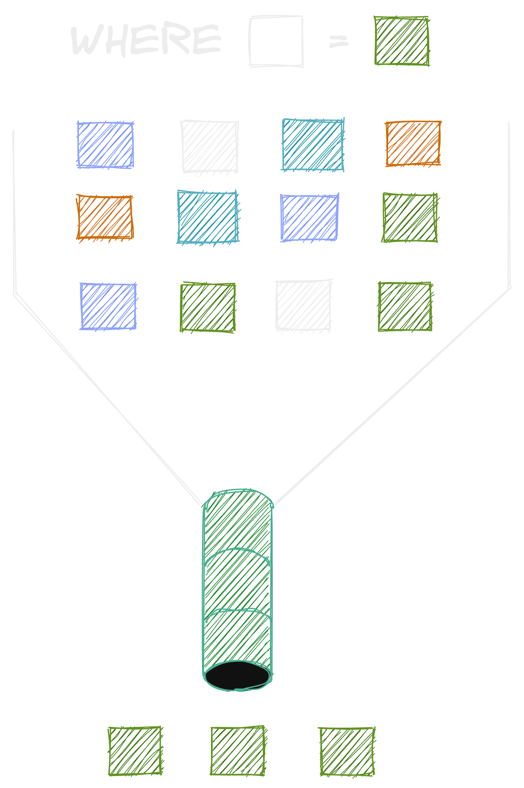
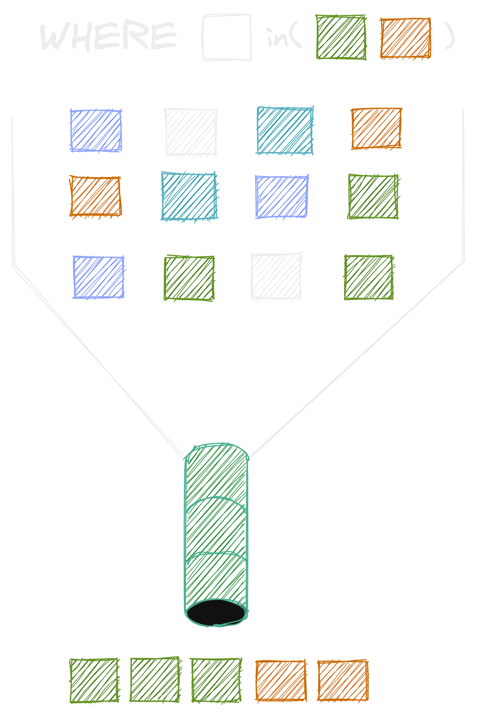
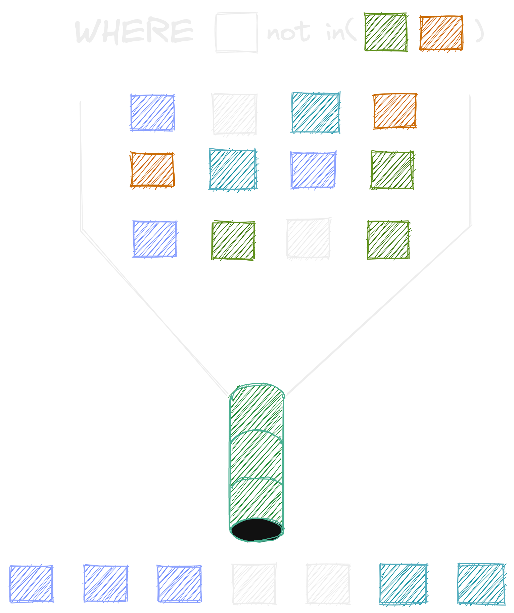
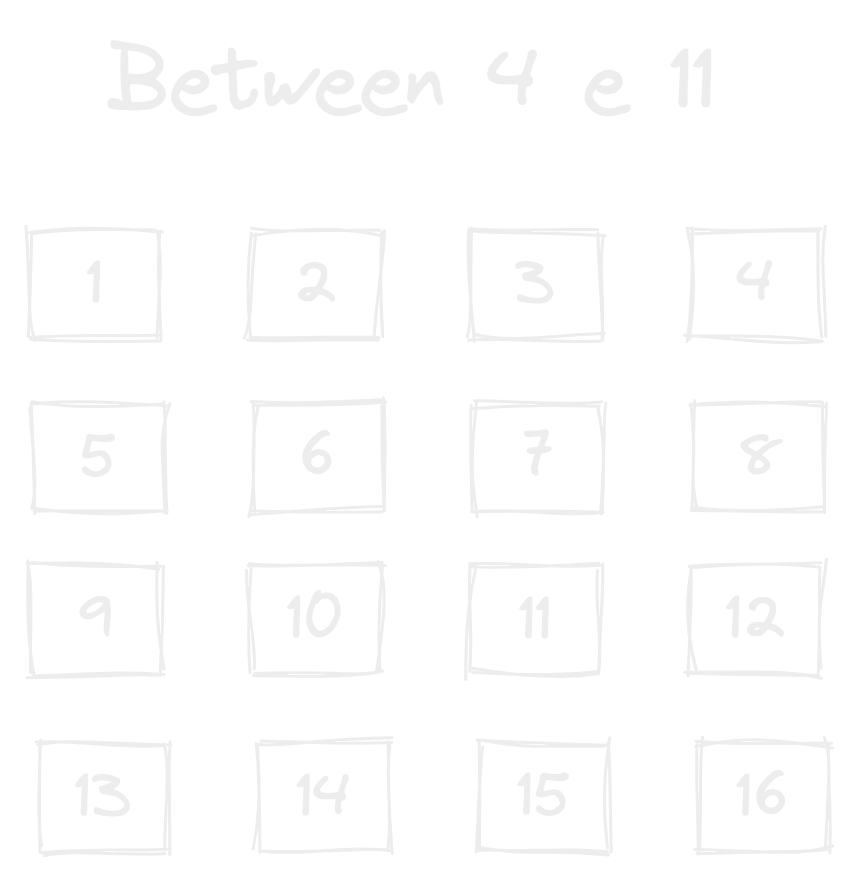
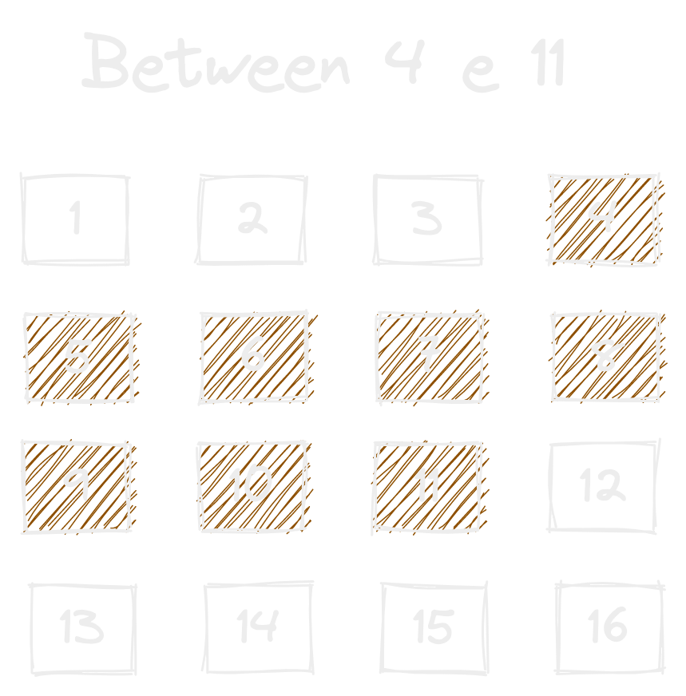

### Filtrando dados

{ width=50% }

---

### Foco de hoje

- WHERE
- IN & NOT IN
- BETWEEN
- LIKE

---

### Where

{ width=35% }

---

### Where exemplo:

```sql
  SELECT * FROM banco.tabela
  WHERE coluna = 'valor';
```

---

### 🤨 Pergunta

> Como encontrar, "Ivone Viana"?

---

#### Resposta

```sql

  SELECT * FROM statistics
    WHERE 
      student_name = 'Ivone Viana';

```

---

### 🎯 Desafio Agora.

> Nome e Nota das pessoas com nota maior que 0.8 e que fazem parte da turma 21-a.


---

### Resposta

```sql

  SELECT student_name, grade
  FROM statistics
  WHERE grade > 0.8
  AND cohort = '21-a';

```

--

### 🎯 Melhorando a resposta

> Como poderia ordernar o resultado por nota de forma decrescente?

--

### Resposta

```sql

  SELECT student_name, grade
  FROM statistics
  WHERE grade > 0.8
  AND cohort = '21-a'
	ORDER BY grade;

```

---

### Vamos engrossar o caldo ?

{ width=50% }

---

### 🤔

> Agora eu quero, a maior nota do Alfeu Lima no dia 2022-04-15 no projeto all-for-one.

---

### Resposta

```sql

  SELECT * FROM statistics 
	WHERE date_analysis = '2022-05-14' 
    AND student_name = 'Alfeu Lima'
	ORDER BY grade 
    DESC LIMIT 1;

```

--

### 🤔 

> Pessoas com nota 1 E que fazem parte da turma 21-a OU 21-b.

--

### Resposta

```sql

SELECT * FROM statistics
	WHERE grade = 1
	AND (cohort = '21-a' OR cohort = '21-b');

```

--

> Porque usar o parenteses?

O uso do parênteses aqui é necessário e muda o resultado porque, sem ele, a pesquisa seria avaliada da seguinte forma:

- Retorne todos os resultados em que grade = 1 AND cohort = '21-a'
- Ou qualquer resultado onde cohort = '21-b'

---

### Ordem

{ width=35% }

---

### Dúvidas?

{ width=90% }

---

### ✋ Calma ae

> E se eu quiser usar múltiplos ORs para as turmas?

---

### Fácil né?

```sql

SELECT * FROM statistics
  WHERE cohort = '21-a'
    OR cohort = '21-b'
    OR cohort = '18-b';

```

---

### ❌ Assim não

```sql

SELECT * FROM statistics
  WHERE cohort = '21-a'
    OR cohort = '21-b'
    OR cohort = '18-b';

```

---

{ width=40% }

---

#### Nesse caso, devemos utilizar o IN

```sql

SELECT * FROM statistics
  WHERE cohort IN (
    '21-a', 
    '21-b', 
    '18-b');

```

---

{ width=50% }

---

#### Negando uma lista

```sql

  SELECT * FROM statistics
    WHERE cohort NOT IN (
      '21-a', 
      '21-b'
    );

```

---

### ✋ PAUSA

---

### BETWEEN


{ width=60% }

--

{ width=60% }

--

### BETWEEN

> Encontre as notas entre 0.5 e 0.8 da turma 18-b.

--

> Resposta

```sql

SELECT * FROM statistics
WHERE grade BETWEEN 0.5 and 0.8
ORDER BY grade DESC;

```

---

### Trabalhando com datas


---

### Formato da data

> A data no SQL é armazenada no formato yyyy-mm-dd

---

### E como trabalhar com data?

```sql
SELECT now();  -- data e tempo de agora
SELECT curdate(); -- data de agora
SELECT curtime(); -- tempo de agora
SELECT year(now()); -- Ano atual
SELECT month(now()); -- mês atual
SELECT day(now()); -- dia atual
```

---

### Complemento

> A hora mínima que podemos armazenar é 00:00:00 e a máxima é 23:59:59, importante caso eu queria encontrar resultados dentro de uma faixa de datas.

---

### Exemplo: resultados em um determinado dia:

```sql

SELECT * FROM statistics 
  WHERE date(date_analysis) = '2002-05-13';

```

---

### Encontrando resultado entre uma faixa mais especifica

```sql

SELECT DISTINCT student_name, grade, date_analysis FROM statistics
  WHERE date_analysis
    BETWEEN 
      CAST('2022-08-06 00:00:00' AS datetime) 
    AND 
      CAST('2022-08-07 23:59:59' AS datetime)
	AND
	  project_name = 'docker-to-do-list'
	ORDER BY grade DESC;

```

---

### Trabalhando com Like 👍🏽


---

> O time de facilitação está tendo dificuldades em lembrar quem pediu flexibilização em um 1:1. A única lembrança é que a pessoa tem 'meri' no nome

Como ajudar a encontrar essa informação?

---

```sql

SELECT student_name FROM statistics
  WHERE student_name LIKE '%meri%';

```

--

### Representações

`%`  -> Uma cadeia de caracteres  
`_` -> Um único caracter

---

### 🛸 Casos curiosos com Like 👽

```sql

  -- Nomes que iniciam com 'EG' a partir da segunda letra
  SELECT * FROM statistics WHERE student_name LIKE '_EG%';

  -- Nomes que iniciam com 'A' a partir da terceira letra
  SELECT student_name FROM statistics
  WHERE student_name LIKE '__A%';

```

---

### Dúvidas?

{ width=90% }

---

## Dados interessantes ...

---

### Dados da turma 21-A

```SQL
# Quantidade de estudante da turma 21-A

# Pessoas da 21-b que tem o projeto entregue no dia 20.3:

# Porcentagem final

```

---

### Quantidade de estudante da turma 21-A

```SQL

SELECT COUNT(DISTINCT student_name) FROM trybe_data.statistics  WHERE 
project_name = 'docker-to-do-list' AND cohort = '21-a';

```

--

#### Pessoas da 21-a que tem o projeto entregue no dia 20.3:

```SQL

SELECT COUNT(DISTINCT student_name) FROM trybe_data.statistics WHERE 
project_name = 'docker-to-do-list' AND cohort = '21-a' 
AND date(date_analysis) IN ('2022-08-06','2022-08-07') AND grade >= 0.5;

```

--

### Porcentagem final
```SQL

SELECT CONCAT((116/140)*100, '%');

```


---

### Dados da turma 18-B

--

> Turma 18 passou pelo dia de hoje 20.3 no dia 24/04/2022

--

### Quantidade de estudante da turma 18-b:

```SQL

SELECT COUNT(DISTINCT student_name) FROM trybe_data.statistics WHERE 
project_name = 'docker-to-do-list' AND cohort = '18-b' 
AND date(date_analysis) IN ('2022-04-23','2022-04-24') AND grade >= 0.5;

```

--

#### Pessoas da 18-b que tem o projeto entregue no dia 21.3:

```SQL

SELECT COUNT(DISTINCT student_name) FROM trybe_data.statistics  WHERE 
project_name = 'docker-to-do-list' AND cohort IN('18-b');

```

--

### Porcentagem final

```SQL
SELECT CONCAT((113/119)*100, '%');
```

---

### RESULTADO

--

### Turma 21-A
- Entrega: 82.8571%

### Turma 18-B
- Entrega: 94.9580%

--

## Vamos deixar barato??