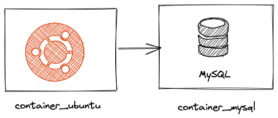
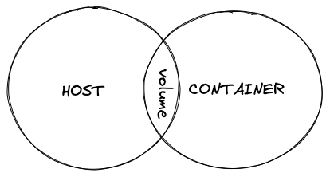

#### Aula 19.3 - Orquestrando Containers com Docker Compose

{width=50%}

--

### Aula 19.3

- Gerenciar redes Docker, utilizando-as para a comunicação e isolamento de containers; 
- Persistir dados dos containers utilizando volumes; 
- Criar arquivos Compose para gerenciar todo seu ambiente com Docker; 
- Gerenciar Services, Network e Volumes a partir do Compose.

---

### Networks

--

### Case 

- Uma API que precisa comunicar com um banco de dados MySQL.

{width=50%}

--

## Como?

> Para que dois containers consigam "conversar" um com outro, precisamos usar um recurso chamado network. 

--

## Como?

> Basicamente, é criar uma rede virtual dentro do contexto do docker para que os containers tenham visibilidade da existência um do outro.

---

#### Vamos iniciar com 2 containers

```sh
$ docker run -itd --name container1 busybox
$ docker run -itd --name container2 busybox

$ docker ps -a
```

--

### Conectando aos containers

```sh
$ docker exec -it container1 /bin/sh
$ docker exec -it container2 /bin/sh  
```

--

### Tentando comunicação ...

```sh
$ ping container2
$ ping container1
```

--

### Porque deu ruim?

--

## Recomeçando ...

---

## Criando uma rede

```sh
$ docker network create -d bridge tryber-network
$ docker network ls
```

--

## Rede criada! 
### Mas ainda precisamos conectar nossos containers

```sh
$ ping container2
$ ping container1
```

--

### Conectando um container a uma rede específica

```sh
$ docker network connect tryber-network container1
```

--

### Verificando quais containers estão conectados a uma rede

```sh
$ docker network inspect tryber-network
$ docker network inspect tryber-network | jq '.[].Containers'

# conectando o container 2
$ docker network connect tryber-network container2
```

--

## Bora pingar?

```sh
$ ping container2
$ ping container1
```

--

### Criando um novo container já conectado a uma rede

```sh
$ docker run -itd --name container3 --network tryber-network busybox
```

--

## Conectando ao 3° container

```sh
$ docker exec -it container3 /bin/sh

$ ping container1
$ ping container2
```

--

## Desconectando de uma rede

```sh
$ docker network disconnect tryber-network container3
$ docker network inspect tryber-network
```

---

### Volumes



--

## Criando um container com um Volume

```sh
$ docker run -vd "trybe/vqv" nginx
# -v inicia um volume
```

--

## Verificando a pasta do volume

```sh
$ docker ps
$ docker inspect <CONTAINER ID> | jq '.[].Mounts'

--

### Saída

```json
"Mounts": [
  {
      "Type": "volume",
      "Name": "de1cb1cf0d8544abb0493901125...",
      "Source": "/var/lib/docker/volumes/de1cb1cf.../_data",
      "Destination": "trybe/vqv",
      "Driver": "local",
      "Mode": "",
      "RW": true,
      "Propagation": ""
  }
]
```

--

### Porque isso é útil?

> Caso eu queira que ele seja volume de um novo container, eu posso reutiliza-lo passando o nome do volume "trybe/vqv"

--

### É possível utilizar uma pasta específica da minha máquina?

> Caso seja necessário armazenar um volume em uma pasta fora do Docker Host

```sh
docker run -it -v "/home/mariotto/Desktop/:/trybe/vqv" ubuntu
```

--

### Vamos ver se funciona


```sh
$ cd /trybe/vqv/
$ touch meu-arquivo.txt
$ echo "Vamo que vamo turma!" > meu-arquivo.txt
```

---

### Criando um container do Ngnix e fazendo biding de um diretório como volume

--

### Vamo criar os diretórios

```sh
$ mkdir meu-nginx && cd meu-nginx
$ mkdir public_html
```

--

```sh
$ docker run --name meu-nginx -p 8080:80 -v $(pwd)/public_html:/usr/share/nginx/html -d nginx
```

- tradução

```sh
$(pwd)/public_html # diretório atual
/usr/share/nginx/html #diretório do nginx
-p 8080:80 #mapeamento de portas
```

--

## Funcionou?

[http://localhost:8080](http://localhost:8080)

--

### Criando o arquivo index.html
```html
<!DOCTYPE html>
   <html>
      <head>
      <title>Usando volumes do Docker</title>
   </head>
   <body>
      <h1>Nossa primeira página usando volumes do Docker!</h1> 
   </body>
</html>

```

--

### Criando outros arquivos

```html
<!DOCTYPE html>
   <html>
      <head>
      <title>Contatos</title>
   </head>
   <body>
      <h1>Rogérinho (99)99999-9999!</h1> 
   </body>
</html>
```

---

### Como provisionar e iniciar vários containers usando Docker-compose.yml

--

> Agora que já sabemos como preparar imagens docker, mapear volumes e redes. Vamos entender como podemos automatizar tudo isso usando uma ferramenta chamada docker-compose.

--

>  Docker-compose é uma ferramenta de orquestração, ou seja, ela serve para definir o que e como queremos levantar containers usando um arquivo com um formato específico, yaml.

--

#### O que é orquestração?

{width=70%}

--

### docker-compose.yml

```yml
version: '3'

services: 
  web:
    image: nginx:latest
    volumes: 
      - ./public_html:/usr/share/nginx/html
    ports:
      - 8080:80
```

--

## Lembra da Mágica?

--

## recordando ...

--


--

Para executar: 
```sh
$ docker-compose up
ou
$ docker-compose up -d
```

Para parar:
```sh
docker-compose stop
```

--

## More magic ..

--

### 2+ containers

```yml
version: '3'

services: 

# servidor nginx
web:
    image: nginx:latest
    volumes: 
      - ./public_html:/usr/share/nginx/html
    ports:
      - 8080:80

# container de DB 
  db:
    image: mysql:5.7
    restart: always
    environment:
      - MYSQL_ROOT_PASSWORD=root
    ports:
      - 33060:3306
    volumes:
      - db:/var/lib/mysql
```

--

## Testando

```sh
$ docker-compose stop
$ docker-compose up -d

$ docker ps
```

--

> Bora aproveitar e utilizar o MySQL junto do Nginx?

--

> Ponto de atenção: O Nginx não pussui um cliente nmysql nativo, precisaremos instalar, como podemos fazer?

--

> Podemos utilizar o Dockerfile para criarmos uma imagem nginx com o cliente sql instalado

--

## Dockerfile

```dockerfile
FROM ubuntu/nginx:latest

RUN apt-get update -y
RUN apt-get install -y mysql-client
```

--

> Agora nosso docker-compose precisa construir nosso container baseado em nosso arquivo Dockerfile, vamos alterar o serviço web

```yml
version: '3'

services: 
  web:
    build: .
    image: ubuntu/nginx:latest
    volumes: 
      - ./public_html:/usr/share/nginx/html
    ports:
      - 8080:80
    depends_on:
      - db
  db:
    image: mysql:5.7
    restart: always
    environment:
      - MYSQL_ROOT_PASSWORD=root
    ports:
      - 33060:3306
    volumes:
      - ./data:/var/lib/mysql
```

--

### Limpando a bagunça ...

```sh
$ docker-compose stop
$ docker container prune
```

--

```sh
$ docker-compose build
$ docker-compose up -d

docker ps
```

--

### Testando a conexão com o MySQL

```sh
$ docker exec -it meu-nginx bash

$ mysql -u root -proot -h db
```

- -u root: usuário do banco que irá conectar.
- -proot: define qual a senha para conectar ao banco (atenção)
- -h db: host que está rodando o container. (nome do serviço)

---

### Dúvidas?

