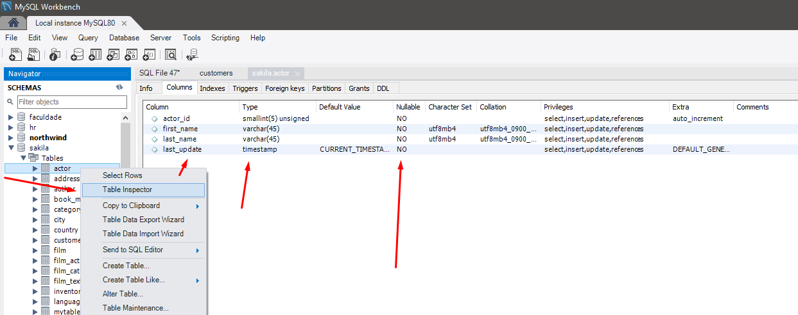
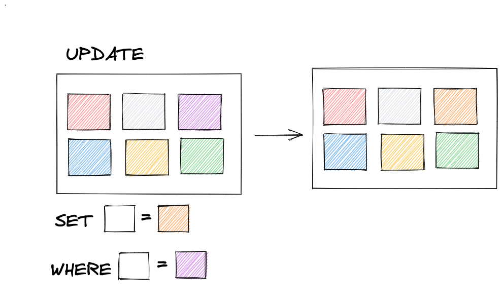

## Manipulando tabelas

{ width=60% }

---


### Foco de hoje

- INSERT
- UPDATE
- DELETE

---

### INSERT

{ width=55% }

---

#### INSERT



---

#### INSERT

```sql
INSERT INTO sakila.actor (first_name, last_name)
VALUES ('Sabrina', 'Gomez');

INSERT INTO sakila.actor (actor_id, first_name, last_name)
VALUES (id_gerado_por_insert_acima, 'Sabrina', 'Gomez';
```

---

#### INSERT auto increment

```sql
INSERT INTO sakila.actor (actor_id, first_name, last_name)
VALUES (300, 'Keanu', 'Reeves'); -- aqui vai inserir com o valor de actor_id igual a 300

INSERT INTO sakila.actor (first_name, last_name)
VALUES ('Will', 'Smith'); -- aqui vai inserir com o valor de actor_id igual a 301

SELECT actor_id FROM sakila.actor ORDER BY actor_id DESC; -- Ficou um intervalo entre o actor_id 200 e 300.
```

---

> O que ocorre com o auto increment caso seja feita a seguinte inserção?

```sql
INSERT INTO sakila.actor (actor_id, first_name, last_name)
VALUES (205, 'Denzel', 'Washington'); 

SELECT actor_id FROM sakila.actor ORDER BY actor_id DESC;
```

---

### INSERT auto increment

> Perceba que o registro de actor_id 205 do INSERT anterior foi executado com sucesso, porém o valor referência do auto increment não alterou.

---

### INSERT auto increment

_Podemos concluir que o auto increment apenas altera sua referência se o id informado manualmente for maior que a atual referência. Então, a referência do auto increment NUNCA tem seu valor diminuido._

---

#### INSERT múltiplos valores

```sql
INSERT INTO sakila.actor (first_name, last_name)
VALUES
 ('Robbins', 'Ferris'),
  ('Tim', 'Souza');
```

---

#### INSERT múltiplos valores

> Mas e se ocorrer erro em algum INSERTs?

---

#### Vamos testar

```sql
INSERT INTO sakila.actor (actor_id, first_name, last_name)
VALUES
  (300, 'Robbins', 'Ferris'), 
	# inválido, pois já existe uma pessoa atora com actor_id igual a 300 na tabela
  (401, 'Tim', null), 
	# inválido, pois o valor da coluna last_name não pode ser nulo
  (402, 'Charles', 'Carson'), 
	# válido, pois não viola nenhuma constraint dessa tabela
  (null, 'John', 'Dee'); 
	# válido, pois o null faz com que o actor_id seja gerado automaticamente pelo auto_incremente da tabela.
```

---

#### INSERT IGNORE

{ width=55% }


---

#### INSERT IGNORE

```sql
INSERT IGNORE INTO sakila.actor (actor_id, first_name, last_name)
VALUES
  (300, 'Robbins', 'Ferris'), 
	# não será inserido, pois já existe uma pessoa atora com actor_id igual a 300 na tabela
  (401, 'Tim', null), 
	# não será inserido pois o valor da coluna last_name não pode ser nulo
  (402, 'Charles', 'Carson'), -- esse será inserido pois não viola nenhuma constraint dessa tabela
```

---

#### Copiando dados com INSERT

```sql
INSERT INTO sakila.actor (first_name, last_name)
SELECT first_name, last_name FROM sakila.customer LIMIT 5;

SELECT * FROM sakila.actor ORDER BY actor_id DESC;
```

---

### UPDATE

---

### Update

```sql
UPDATE sakila.customer
SET email = "c.terry@sakilacustomer.org"
```

---

#### Prêmio Update sem Where

{ width=55% }

---

#### UPDATE sem WHERE

{ width=55% }

---

#### UPDATE com WHERE

{ width=55% }

---

#### COMO DAR UPDATE SEM PERDER O EMPREGO?

```sql
UPDATE sakila.customer
SET email = "c.terry@sakilacustomer.org"
WHERE first_name = "TERRY";
```

---

## FOI QUASE ...

Alterou o email de todos os registros com first_name como TERRY (2 registros)

---

## AGORA VAI

```sql
UPDATE sakila.customer
SET email = "c.terry@sakilacustomer.org"
WHERE customer_id = 253;
```

> _Dica: Sempre usar um identificador único_

---

### DELETE

---

### DELETE

{ width=55% }

---

#### DELETE

```sql
DELETE FROM sakila.film_text
WHERE title = 'ALASKA PHANTOM';
-- vai que existe mais do que um filme com o mesmo título, melhor usar o id:
DELETE FROM sakila.film_text
WHERE film_id = 12;
```

---

## DELETE LÓGICO

---

### DELETE

```sql
UPDATE sakila.customer
SET active = 0 -- Colocar o valor zero (false) na coluna active
WHERE customer_id IN (1, 2); -- O identificador do cliente em questão
```
_Note que a **exclusão lógica** é uma query de UPDATE e não de DELETE_

---

### BUSCA

```sql
SELECT * 
FROM sakila.customer 
WHERE active = 1; -- Retornando apenas os que tem o active em 1 (true)
```

---

#### DELETE - Restrições

```sql
ON DELETE RESTRICT | NO ACTION
```
<span style="font-size:24px;">_Não permitirá que essa ação seja executada_</span>

```sql
DELETE FROM sakila.customer WHERE customer_id = 1;
```

---

<span style="font-size:24px;">Necessário deletar as referências antes de fazer o DELETE</span>


```sql
DELETE FROM sakila.payment WHERE customer_id = 1; -- Deletar as referências em payment
DELETE FROM sakila.rental WHERE customer_id = 1; -- Deletar as referências em rental
DELETE FROM sakila.customer WHERE customer_id = 1; -- Então, deletar o customer
```

---

#### DELETE - Restrições
```sql
ON DELETE SET NULL
```
<span style="font-size:24px;">_Permitirá que essa ação seja executada e irá setar como NULL na tabela de referência para o id correspondente._</span>

```sql
SELECT * FROM sakila.payment WHERE payment_id = 1;
```

---

#### DELETE - Restrições
```sql
ON DELETE CASCADE
```
<span style="font-size:24px;">_Permite que que seja deletado e ainda exclui todas as referências dos registros que usam o ID que foi excluída._</span>

<span style="font-size:24px;">Vamos adaptar a tabela Customer</span>

---

### Dúvidas?

{ width=90% }```

---

#### Praticar?

---

#### Praticar?

1. Adicione os dois principais atores do novo filme Matrix na tabela actor;
2. Adicione o filme Matrix 4 na tabela film;
3. Faça a ligação na tabela film_actor destes registros inseridos anteriormente;  
4. Insira na tabela inventory um registro com o id deste filme para a loja com id igual a 1;
5. Crie você como pessoa usuária na tabela customer (faça a associação do seu cadastro com um registro já existente na tabela address);

---

#### Praticar?

6. Insira os dados de aluguel na tabela rental deste filme, como sendo realizado a retirada do filme no dia 09/08/2022;
7. Faça a atualização com a devolução do filme no dia de hoje (09/08/2022) na tabela rental, no registro que foi inserido anteriormente (return_date);
8. Faça o delete lógico (update) do seu usuário na tabela customer (mudar o status de active para 0);
9. Bônus: deletar todos registros inseridos anteriormente;

