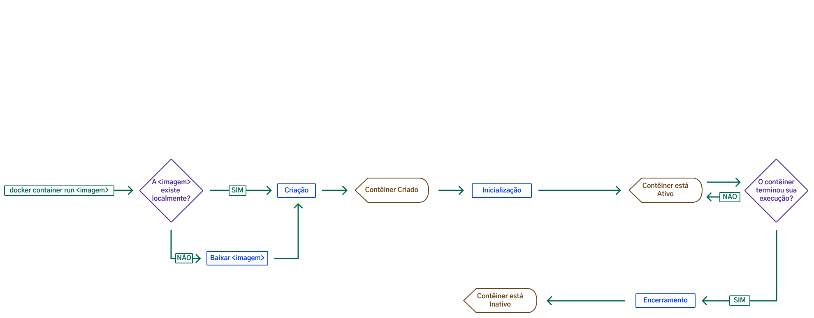

## Aula 19.2

- Entender o processo de criação de imagens com Docker;
- "Dockerização" de aplicações;

--

## Aula 19.2

> Hoje, vamos apresentar como funciona o trabalho com imagens e containers em Docker, com a utilização de mapeamento de portas e principalmente focar na criação e uso do Dockerfile.

--

### Container x Imagem

Criamos um container a partir de uma Imagem
```sh
$ docker run hello-world
```

{width=75%}

--

## Relembrando ...

{width=100%}

---

## Lembra que tudo começa no Dockerfile? 

--

## Dockerfile

--

## Dockerfile

> Como criar nossas próprias imagens? Criando uma receita de bolo.

--

> Você deve ter percebido que em Docker, precisamos escrever muitos comandos de configuração para obtermos o resultado que desejamos.

--

> Dentro de um time com muitas pessoas desenvolvedoras é possível que erros aconteçam se não houver nenhum tipo de uniformização desses comandos.

--

> É ai que entra o Dockerfile.

--

### Dockerfile

- Arquivo de texto
- Sequência de comandos
- A finalidade é criar imagens que geram containers

---

### Nosso case

> Subir um servidor HTTP com Nginx e colocar o conteúdo HTML dentro do container para ser acessado pelo host.

--

### Passo a passo

- Criar o arquivo Dockerfile
- Escolher a imagem base (Nginx)
- Criar o arquivo HTML (index)
- Copiar os arquivos da nossa máquina para o Container
- Criar a imagem

--

### Criar o arquivo Dockerfile

--

### Escolher a imagem base

```yml
FROM nginx
```

--

### Que imagem é essa?

https://hub.docker.com/_/nginx

--

### Criar o arquivo index.html

```html
<!DOCTYPE html>
<html>
  <head>
    <title>Welcome to nginx!</title>
    <style>
      html { color-scheme: light dark; }
      body { width: 35em; margin: 0 auto;
      font-family: Tahoma, Verdana, Arial, sans-serif; }
    </style>
  </head>
<body>
  <h1>Hello Docker!</h1>
  </body>
</html>

```

--

### Copiar os arquivos da nossa máquina para o Container

```yml
# FROM nginx
COPY index.html /usr/share/nginx/html
```

--

### Por que pra esse diretório?

Veja a configuração do nginx:

```sh
# Vamos abrir um terminal em um container nginx
docker run -it nginx bash

# Vamos ver a configuração
cat /etc/nginx/conf.d/default.conf

# E o que tem nesse diretório?
ls -a /usr/share/nginx/
```

--

### Criando a imagem

```sh
$ docker build -t mariotto/hello-nginx .

# -t nomeia uma imagem
# nome_usuario/nome_imagem
# . indica onde está o Dockerfile
```

---

### Criando um container a partir da nossa imagem

```sh
$ docker run -d mariotto/hello-nginx
```

--

### Vamos ver se deu bom

```sh
$ docker ps
```

--

#### Como podemos acessar uma porta dentro de um Container?

--

```sh
#acessamos o container
$ docker exec -it <CONTAINER ID> bash

# realizamos requisição
$ curl http://localhost:80
```

--

### Assim não faz sentido

> Chegamos a conclusão de que a aplicação está funcionando, porém ela só está acessível dentro do container

---

### Vamos entender melhor ...
[Não clique](https://excalidraw.com/#room=00bf68498c99a6ba5101,JPLR7Bs0JBV5w4-k7cpGGg)

---

### Recomeçando

> Vamos criar um novo container, dessa vez vamos configurar uma porta junto do nosso host

```sh
$ docker run -d -P mariotto/hello-nginx
# -P o docker configura as portas de forma automática
```

---

### E se eu quiser determinar uma porta específica?
##### HOST X CONTAINER
```sh
$ docker run -d -p 80:80 mariotto/hello-nginx
# -p nós configuramos uma porta específica
```

---

## Por hoje é só pessoal


