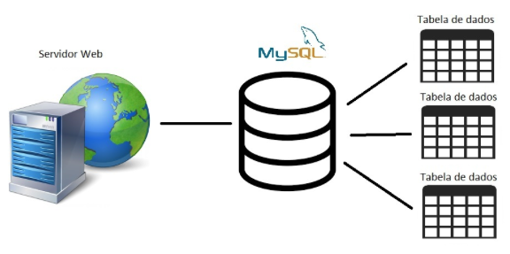
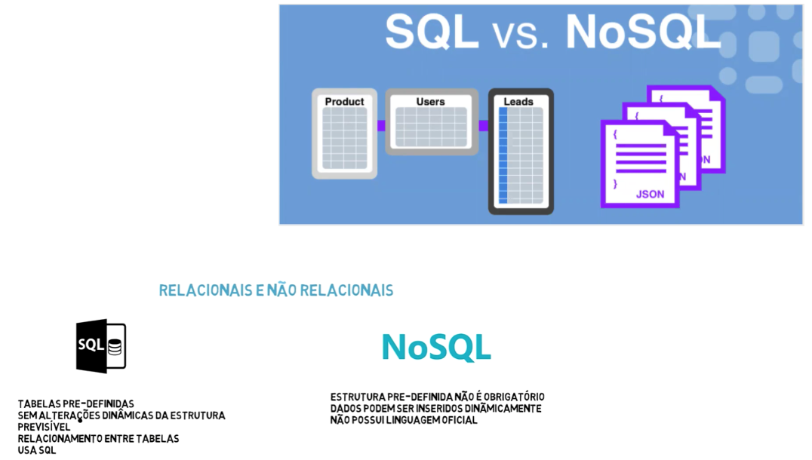
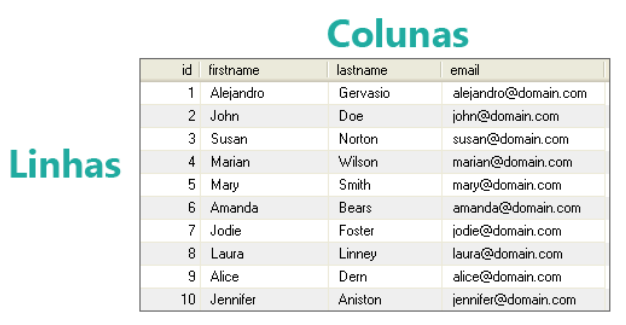
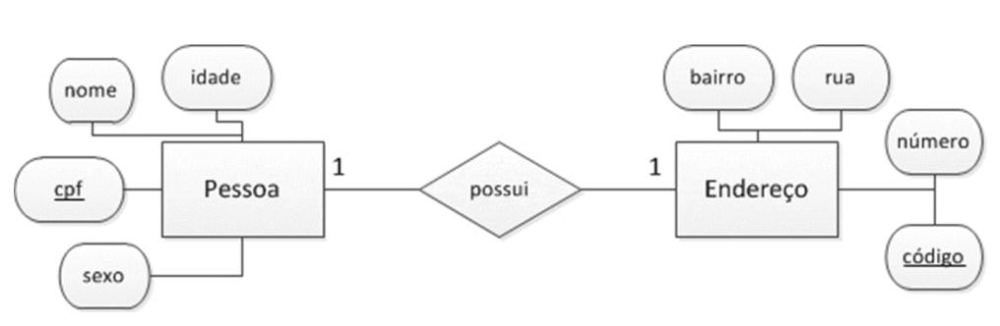
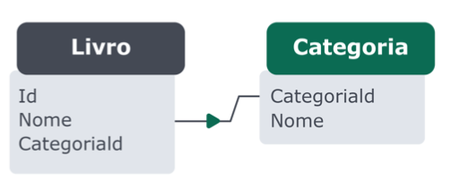
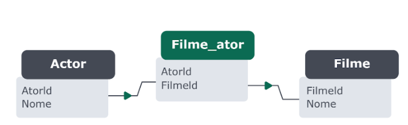

### Banco de Dados SQL

Bloco 20 - Aula 20.1

---

### Roadmap Aula

- Docker e MySQL;
- SQL x NoSQL;
- Banco de Dados;
- SGBD;
- Tabelas;
- Constraints;
- MySQL CLI;
- MySQL Workbench;
- Atividade prática;

---

### Mysql no Docker

```yml
version: '3'
services:
  # Database
  db:
    platform: linux/x86_64
    image: mysql:5.7
    volumes:
      - ./db_data:/var/lib/mysql
    restart: always
    ports:
      - 3306:3306
    environment:
      MYSQL_ROOT_PASSWORD: root
```

---

### Para você, o que é um DADO?


---

### Papel do banco de dados

- Organizar os dados;
- Armazenar;
- Cuidar da segurança;
- Cuidar de falhas;
- Entre outros;



---

### SGBD

- Sistemas Gerenciadores de Banco de Dados


---

### SQL x NoSQL



[Ranking](https://db-engines.com/en/ranking)

---

### SQL

- SQL é a linguagem usada para criar, pesquisar, extrair e também manipular dados dentro de um banco de dados relacional;

- Para que isso seja possível, existem comandos como o SELECT, UPDATE, DELETE, INSERT e WHERE, entre outros;

---

### SQL - CRUD


---

### Tabelas em SQL

- Todas as pesquisas realizadas dentro de um banco de dados são feitas em tabelas; 

- Tabelas possuem linhas e colunas;

- Linhas representam um exemplo, ou instância, daquilo que se deseja representar, ao passo que colunas descrevem algum aspecto da entidade representada;

---

### Tabelas em SQL



---

### Constraints

- Uma das grandes vantagens de armazenar seus dados em um banco de dados é de possibilitar a criação de regras e restrições (constraints , em inglês), que ditam exatamente como os dados podem ou não ser manipulados em suas tabelas;

- Como as constraints são aplicadas às colunas das tabelas, é possível assegurar que os dados inseridos nelas serão consistentes conforme as regras definidas;

---

### Constraints


---

### Constraints

**NOT NULL**
- Garante que aquele campo não pode conter valores nulos, ou seja, se não houver um valor padrão (DEFAULT) definido, será sempre necessário passar um valor para esse campo durante um INSERT, por exemplo;

---

### Constraints

**UNIQUE**

- Garante que o valor inserido na coluna da tabela é único, isto é, não pode haver outro valor igual para esta coluna registrado nesta tabela;

---

### Constraints

**DEFAULT**

- Garante que, caso nenhum valor seja inserido na coluna (ou caso a pessoa usuária insira um valor nulo), a constraint colocará o valor padrão que for passado para ela;

---

### Constraints

**PRIMARY KEY**

- A chave primária de uma tabela garante que a coluna em que essa constraint está sendo aplicada é o identificador único da tabela; 
- Ela também é, por definição, não nula (mesmo efeito da constraint NOT NULL) e única (mesmo efeito da constraint UNIQUE);

---

### Constraints

**FOREIGN KEY**

- A chave estrangeira de uma tabela faz referência a uma chave primária (valor em uma coluna com a constraint PRIMARY KEY) de outra tabela, permitindo um relacionamento entre as duas;

---

### Entidade

- Quando se fala de entidades de um banco de dados, estamos normalmente falando de uma tabela que representa algum conceito do mundo real que você quer descrever (pessoa, eventos, acontecimentos) e suas propriedades (altura, horário do evento, nome do acontecimento);

---

### Entidade

- A entidade é nossa tabela dentro de um banco de dados e as propriedades fazem parte dessa tabela;

- Em alguns desses casos, as entidades são individuais e não se relacionam entre si, porém às vezes elas são ligadas umas com as outras através de relacionamentos;

---

###  Tipos de Relacionamento

**Um para Um**

- Uma linha da Tabela A só deve possuir uma linha correspondente na tabela B ou vice-versa



---

###  Tipos de Relacionamento

**Um para Muitos ou Muitos para Um**

- Uma linha na tabela A pode ter várias linhas correspondentes na tabela B , mas uma linha da tabela B só pode possuir uma linha correspondente na tabela A



---

###  Tipos de Relacionamento

**Muitos para Muitos**
- O tipo de relacionamento muitos para muitos acontece quando uma linha na tabela A pode possuir muitas linhas correspondentes na tabela B e vice-versa



---

### Atividade

- Crie um banco de dados denominado trybe
- Crie uma tabela denominada pessoa_estudante com os seguintes campos: id (PK, Auto Incremento), nome (varchar e not null), data de nascimento (date e not null), situacao (tinyint e not null), descricao (varchar), data de criacao (timestamp com valor default) e data de atualizacao (timestamp com valor default)
- Crie uma tabela denominada endereco com os seguintes campos: id (PK, Auto Incremento), endereco (texto e not null), cidade (varchar e not null), estado (varchar e not null), id_pessoa (chave estrangeira) 
